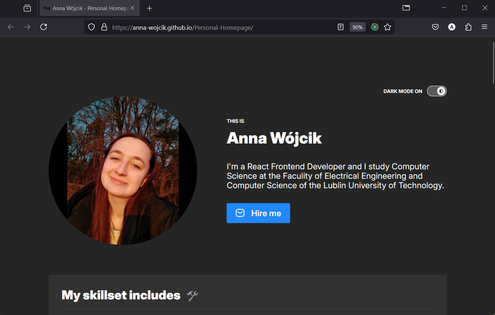
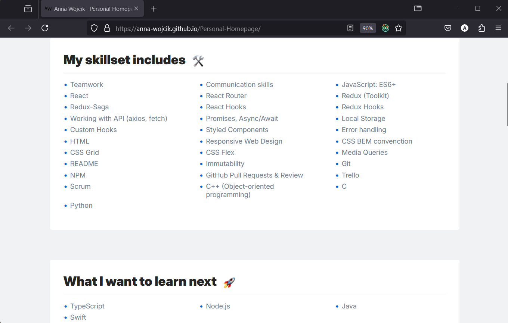
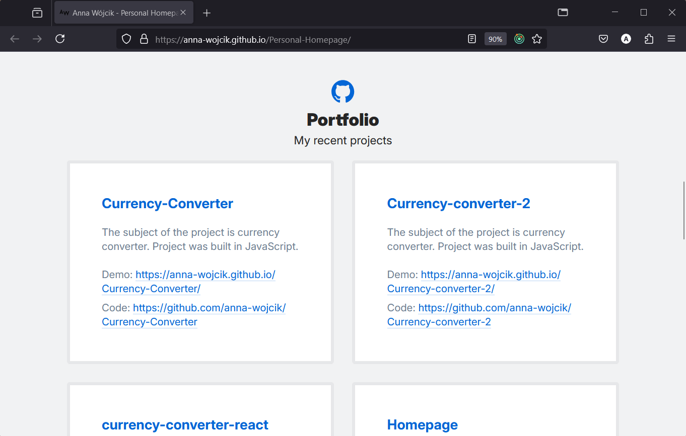
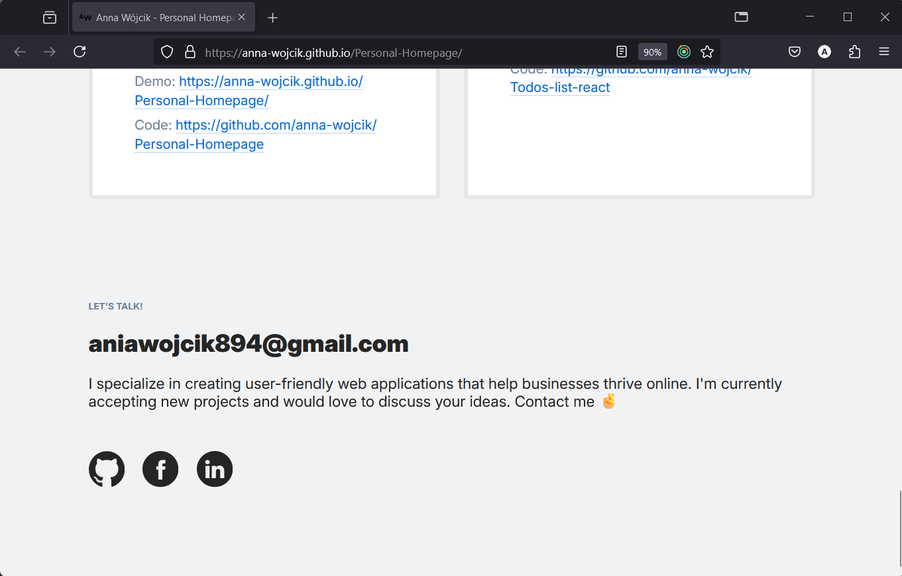

# Personal Homepage
This website depicts my Personal Homepage. The site presents my skills, thing which I want to learn, the projects I created and contact details.
 
Here is a working live demo: https://anna-wojcik.github.io/Personal-Homepage/.
 
This project was bootstrapped with [Create React App](https://github.com/facebook/create-react-app).

## Table of Contents
* [Site](#site)
* [Gif](#gif)
* [Technologies Used](#technologies-used)
* [Available Scripts](#available-scripts)
* [Acknowledgements](#acknowledgements)
* [Author](#author)

## Site
### Personal information & Changing theme
The first part of the website are personal information about me. At the bottom you can find blue button to write e-mail to me.
 
In the top right corner is button to change the theme of the page.

### Skills & What I want to learn
Second part of the page depicts my skills and things I want to learn in the foreseeable future. 

### Projects
Third part of the page is a showcase of my projects. You can find a link to the project. First link, named "Demo", will take you to website, while second link "Code" will sends you to GitHub repository.

### Contact
In last part you can find contact details and a couple ways to send me a message: e-mail, GitHub, Facebook, LinkedIn.

## Gif

## Technologies Used
- JavaScript ES6
- Redux - Toolkit
- Axios
- Styled Components
- Hooks (useState, useEffect)
- Custom Hooks
- HTML 5
- CSS 3
- Media Queries
- Normalize CSS
- BEM Convention
- Grid

## Available Scripts

In the project directory, you can run:

### `npm start`

Runs the app in the development mode.\
Open [http://localhost:3000](http://localhost:3000) to view it in your browser.

The page will reload when you make changes.\
You may also see any lint errors in the console.

### `npm test`

Launches the test runner in the interactive watch mode.\
See the section about [running tests](https://facebook.github.io/create-react-app/docs/running-tests) for more information.

### `npm run build`

Builds the app for production to the `build` folder.\
It correctly bundles React in production mode and optimizes the build for the best performance.

The build is minified and the filenames include the hashes.\
Your app is ready to be deployed!

See the section about [deployment](https://facebook.github.io/create-react-app/docs/deployment) for more information.

### `npm run eject`

**Note: this is a one-way operation. Once you `eject`, you can't go back!**

If you aren't satisfied with the build tool and configuration choices, you can `eject` at any time. This command will remove the single build dependency from your project.

Instead, it will copy all the configuration files and the transitive dependencies (webpack, Babel, ESLint, etc) right into your project so you have full control over them. All of the commands except `eject` will still work, but they will point to the copied scripts so you can tweak them. At this point you're on your own.

You don't have to ever use `eject`. The curated feature set is suitable for small and middle deployments, and you shouldn't feel obligated to use this feature. However we understand that this tool wouldn't be useful if you couldn't customize it when you are ready for it.

## Acknowledgements
This website was created thanks to the skills gained from the course "Frontend Developer from the basis" online programming school YouCode.

## Author
Created by Anna Wójcik.